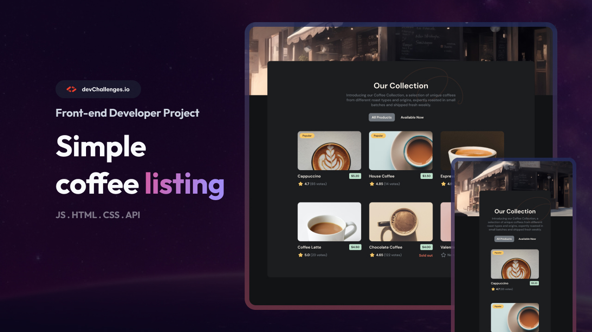

<h1 align="center">Simple Coffee Listing | devChallenges</h1>

   Solution for a challenge <a href="https://devchallenges.io/challenge/simple-coffee-listing" target="_blank">Simple Coffee Listing</a> from <a href="http://devchallenges.io" target="_blank">devChallenges.io</a>.

  <h3>
    <a href="https://simple-coffee-listing-master-kappa.vercel.app/">Demo</a>
     | 
    <a href="https://github.com/kiy0raaaa/simple-coffee-listing-master.git">Solution</a>
     | 
    <a href="https://devchallenges.io/challenge/simple-coffee-listing">Challenge</a>
  </h3>

## Table of Contents

- [Overview](#overview)
- [What I learned](#what-i-learned)
- [Useful resources](#useful-resources)
- [Built with](#built-with)
- [Features](#features)
- [Contact](#contact)

## Overview

This is my solution to the Simple Coffee Listing challenge on devChallenges.io.
The page displays a coffee menu with filtering, ratings, and availability status.

### What I learned

This project was my first time building something with React properly.
A few things that clicked for me during this:

- How `useState` actually works for filtering — I kept overthinking it at first
- The difference between fetching from an API vs importing a local JSON file
- How `grid-template-columns: repeat(3, 1fr)` + `max-width` media queries
  handle responsive layouts without a lot of fuss
- Conditional rendering in JSX (`{condition && <Component />}`)
  is way cleaner than I expected

### Useful resources

- [React Docs – Conditional Rendering](https://react.dev/learn/conditional-rendering)
- [CSS Grid Guide – css-tricks.com](https://css-tricks.com/snippets/css/complete-guide-grid/)
- [Vite Getting Started](https://vitejs.dev/guide/)

## Built with

- React 18
- Vite
- CSS (Flexbox + Grid)
- Local JSON for data

## Features

- Filter between All Products and Available Now
- "Popular" badge shown conditionally per item
- "Sold out" label for unavailable items
- "No ratings" state with empty star for unrated items
- Responsive layout: 3 columns on desktop, 2 on tablet, 1 on mobile

## Contact

- GitHub [@kiy0raaaa](https://github.com/kiy0raaaa)